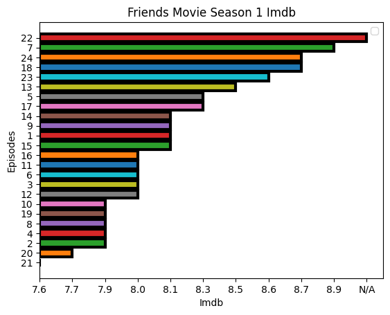

# Friends_API

An example project for data science that using  friends movie API.
API URL was taken from https://www.omdbapi.com/
Also json editor pages were used.

### About Friends 
There is no specific API key or dedicated API for analyzing the "Friends" TV show. "Friends" is a popular American sitcom, and analyzing it would typically involve watching the episodes and manually extracting information or using natural language processing techniques. I found from omdbapi.com about friends. But knowledges are limited. If you want to see another API example, you can look : 
https://github.com/nurfkutlu/Youtube_API_Project/tree/main.

### Json Editor Pages
 - https://www.objgen.com/json/local/rh49EaBVJ
 - https://jsonformatter.org/json-editor

### Conclusion :
  
I analyzed season 1 episodes's imdb by API.